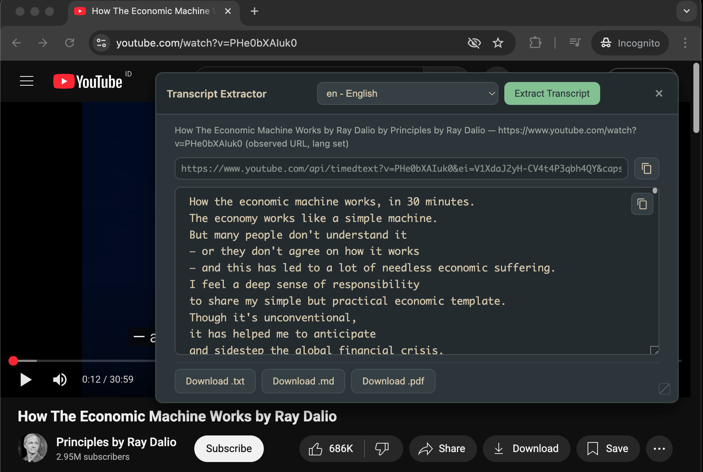
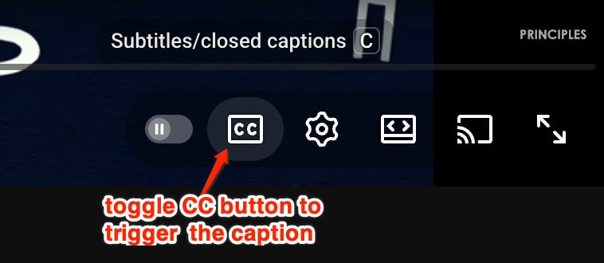

# YouTube Closed Caption Tool

[](https://raw.githubusercontent.com/withLinda/youtube-closed-caption-tool/main/userscript/yt-transcript.user.js)

Simple, copy‑paste browser console tool to extract subtitles/closed captions from YouTube videos. It automatically enables CC, collects the transcript, and lets you copy or download it as TXT, Markdown, or PDF — all client‑side.

## Screenshot 


## Quick Start and how-to video


https://github.com/user-attachments/assets/097b1fa8-c8b8-4bfb-80ed-bade00ae49cc


- Open a YouTube video (watch page or Shorts).
- Open DevTools console (`Cmd+Option+J` on macOS, `Ctrl+Shift+J` on Windows/Linux).
- Open `console.js`, copy the entire file, paste into the browser console, then press Enter.
- A compact panel appears. Click "Extract", if it doesn't load, click the CC button multiple times (toggle) to fetch the transcript, then use the buttons to copy or download.

## Install as a Tampermonkey Userscript

Prefer a one-click setup that runs automatically on YouTube? Install the userscript:

- **[Tampermonkey – Quick Install](https://raw.githubusercontent.com/withLinda/youtube-closed-caption-tool/main/userscript/yt-transcript.user.js)**
  - After installing, visit any YouTube video or Short; the same floating panel will appear and behave exactly like the console version.
  - The userscript simply loads the canonical `console.js`, so features and UI stay 1:1 without code duplication.

## Features

- Auto‑enables the YouTube CC (Subtitles) button for you.
- Works on regular videos and Shorts.
- Exports: `.txt`, `.md`, `.pdf`.
- Best‑effort language detection with preference for English; configurable.

## Tips

- If captions don’t load immediately, click the CC button shown below.
- 
- Some videos only have auto‑generated (ASR) captions; quality varies.
- Everything runs locally in your browser; nothing is uploaded.

## Configuration (optional)

You can tweak a few global values before pasting the script to make it more aggressive or relaxed when enabling CC. Example:

```js
// Increase total wait for a caption request and number of CC retries
window.OBSERVE_WAIT_MS = 9000;
window.AUTO_ENABLE_CC_ATTEMPTS = 10;
```

## License

For personal use only. Make sure your usage complies with YouTube’s Terms of Service and local laws.
